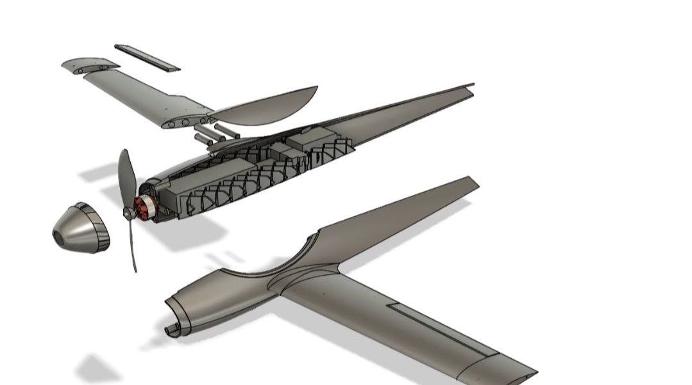

# ep-01

This is my first attempt at fully designing a 3D-printed plane!

- [Latest version of the CAD file](https://a360.co/4iGe8d7)
- [BOM](https://docs.google.com/spreadsheets/d/1kQXu4HxpaMfNq_HhcPPsLEbtb_D5R8COA5fg4BuFE68/edit)

I started this project because I thought it would be really cool to experience the process of actually making something that flies and be able to fully print said thing. I got some documentation written on hackclubs journey, which i might paste here after the event ends, for now ill only add some pics and short descriptions tho

## Pictures!

### CAD design

The current design i have made, currently working on the fuselage and printing the wings

### Wings

Latest print of the wing that i made last evening, weighs about 2x less than the last version (little testing car thing for propellers in the background)

### Body

inner structure of the plane to hold components in place, 2 9g servos held in place by some wire and a fs ia10b receiver
