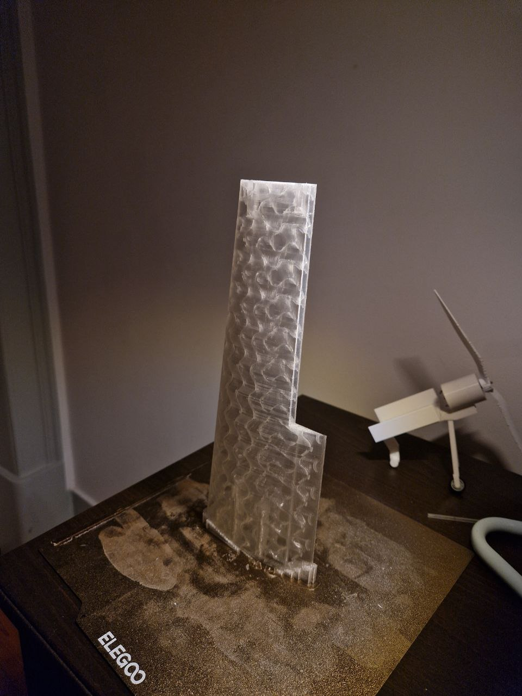
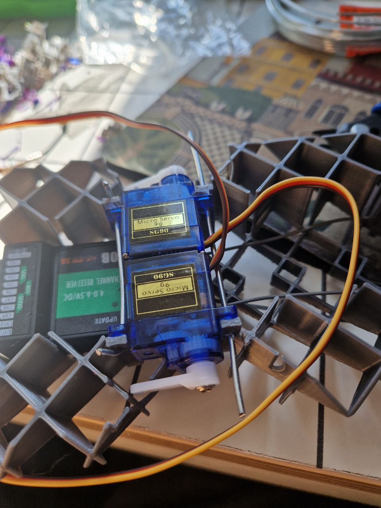
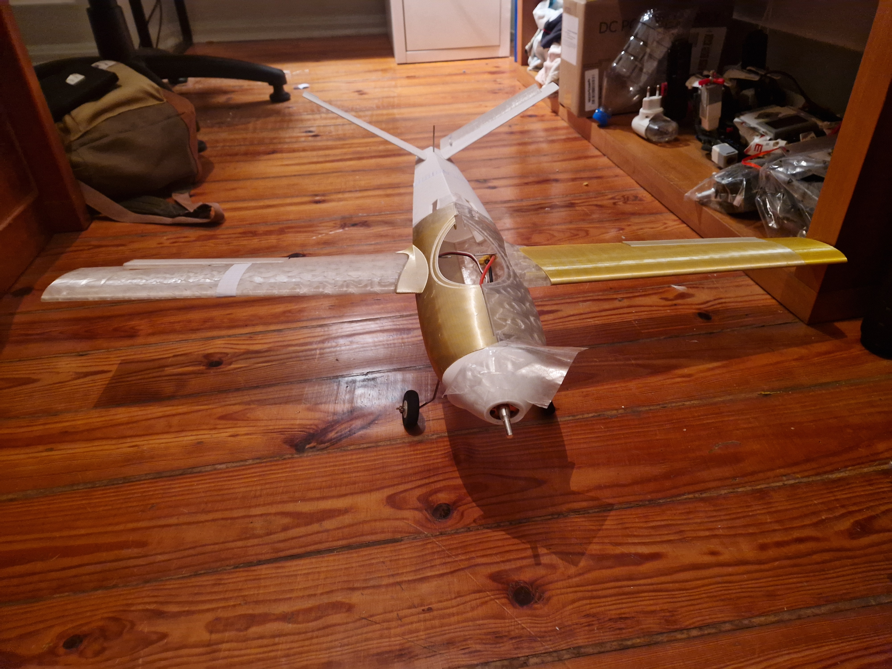
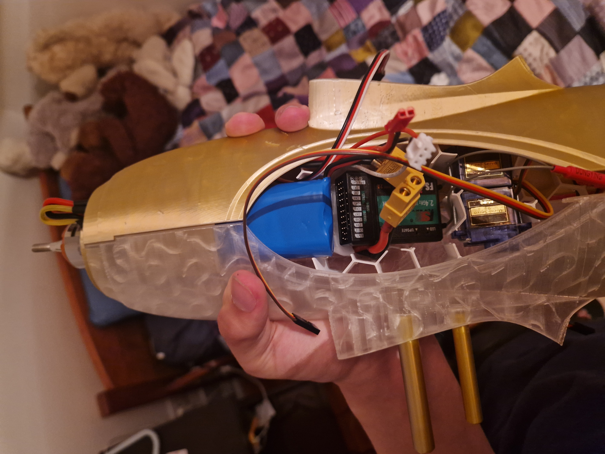

# ep-01

This is my first attempt at fully designing a 3D-printed plane!

- [Latest version of the CAD file](https://a360.co/4iGe8d7)
- [BOM](https://docs.google.com/spreadsheets/d/1kQXu4HxpaMfNq_HhcPPsLEbtb_D5R8COA5fg4BuFE68/edit)

I started this project because I thought it would be really cool to experience the process of actually making something that flies and be able to fully print said thing. I got some documentation written on hackclubs journey, which i might paste here after the event ends, for now ill only add some pics and short descriptions tho

## Pictures!

### Wings

Latest print of the wing that i made last evening, weighs about 2x less than the last version (little testing car thing for propellers in the background)

Wings are made out of 2 pieces since my printer isnt tall enough and i need those 10cm of wingspan

### Body

inner structure of the plane to hold components in place, 2 9g servos held in place by some wire and a fs ia10b receiver

update: remodeled the structure to be hexagonally-shaped and lightweight

### Whole assembly 

Plane without the inner components and stuff

### Components

Components inside the plane hull, receiver battery (blue), sitting on the motor battery, with receiver and wing servos